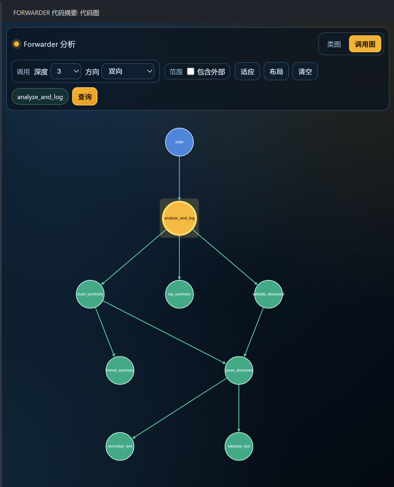
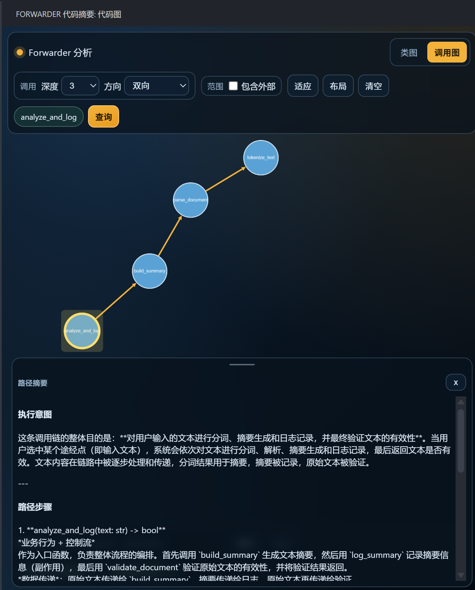

# Forwarder

[English](README.md) | 中文

Forwarder 是一个面向代码理解的 VS Code 扩展。它会基于 VS Code 语言服务分析项目中的类、接口、函数和方法关系，在侧边栏中生成可交互的类关系图、函数调用图和调用路径，并可借助 VS Code Language Model API 为关键节点生成 AI 摘要。

## 适合做什么

- 快速浏览一个项目里主要类、接口、函数之间的结构关系。
- 围绕某个类查看继承、实现、组合、依赖、聚合等关系。
- 围绕某个函数查看向外调用、向内调用或双向调用图。
- 将多个函数按顺序加入路径托盘，查询它们之间的调用路径。
- 对函数、方法、类或接口节点生成简短的 AI 摘要，辅助理解其职责和上下文。
- 在图节点和源代码之间跳转，减少在文件中手动追踪调用链的成本。

Forwarder 更适合“读懂已有项目”和“定位功能实现路径”，不是替代编译器、静态检查器或完整 UML 建模工具。

## 核心功能

### 类关系图

Class Graph 用于查看项目中的类型结构。你可以按需勾选关系类型，然后点击 `Query` 生成当前工作区的关系图。

支持展示的关系包括：

- `Extends`：继承关系。
- `Implements`：接口实现关系。
- `Composes`：类通过字段持有另一个类或接口。
- `Dependencies`：方法签名中通过参数或返回值依赖其他类型。
- `Aggregates`：外部参数被赋值到同类型字段，例如构造函数注入或依赖注入场景。

点击类或接口节点后，Forwarder 会以中心卡片展示该类型的字段和方法。方法条目可以跳转到源码，也可以加入调用路径。

 

### 函数调用图

Call Graph 用于围绕一个函数或方法查看调用关系。你可以把编辑器光标放到函数体内，通过右键菜单或命令将它设为调用图中心，也可以在调用图中右键节点继续切换中心。

调用图支持：

- 设置调用深度。
- 查看 `Outgoing`、`Incoming` 或 `Both` 方向。
- 选择是否包含工作区外部符号。
- 从图节点跳转回源码。
- 将图节点加入有序调用路径。

 

### 有序调用路径

Forwarder 提供一个共享的调用路径托盘。你可以从编辑器命令、类卡片方法列表或调用图节点中把函数加入托盘，并通过拖拽调整顺序。

- 选择 2 个函数时，Forwarder 会查询两点之间的调用路径。
- 选择 3 个及以上函数时，Forwarder 会按你指定的顺序分段拼接路径。
- 如果某一段无法连通，结果会保留失败段信息，便于判断断点在哪里。
- 路径结果可以继续生成路径摘要，帮助理解这条调用链大致完成了什么。

  

### AI 摘要

Forwarder 通过 VS Code Language Model API 调用可用聊天模型，为图节点生成摘要。当前实现支持：

- 函数或方法摘要：基于函数签名、源码范围和文件语言生成。
- 类或接口摘要：结合字段、方法签名、方法摘要和一跳类型关系生成。
- 调用路径摘要：基于路径上的函数摘要和调用顺序生成。
- 摘要缓存：按目标节点、模型、提示词版本、语言和源码哈希保存历史结果。
- 模型选择：在 Forwarder 标题区域打开模型菜单，选择当前摘要模型。
- 陈旧标记：当源码或关系上下文变化后，旧摘要仍可显示，但会被标记为 stale。

节点没有摘要时，普通悬停不会自动请求模型。长按函数、方法、类或接口节点会触发摘要生成；已有摘要的节点悬停后会显示摘要卡片。

## 使用前准备

### VS Code 版本

Forwarder 需要 VS Code `1.107.1` 或更高版本。

### 语言服务

Forwarder 主要依赖 VS Code 的 Document Symbol、Definition、Type Hierarchy、Call Hierarchy 等语言服务能力。请为目标语言安装并启用对应的语言扩展，例如：

- Python：`ms-python.python`
- TypeScript / JavaScript：VS Code 内置 TypeScript 语言功能
- Go：`golang.Go`
- Java：`redhat.java`
- C / C++：`ms-vscode.cpptools`
- C#：`ms-dotnettools.csharp`
- Rust：`rust-lang.rust-analyzer`
- PHP：`bmewburn.vscode-intelephense-client`

如果某个语言服务未安装或暂时不可用，Forwarder 会尽量降级分析，但符号、关系或调用图可能不完整。

### AI 摘要依赖

AI 摘要需要 VS Code 中存在可用的 Language Model Chat 模型。通常你需要：

- 安装并登录 GitHub Copilot Chat，或其他向 VS Code 暴露 Language Model API 的扩展。
- 确认当前环境允许扩展调用聊天模型。
- 在 Forwarder 顶部模型菜单中选择可用模型，或在设置中指定默认模型显示名。

如果没有可用模型，结构图仍可使用，但摘要生成会失败。

## 快速开始

1. 在 VS Code 中打开一个项目文件夹。
2. 等待 Forwarder 完成初始索引。大型项目首次扫描可能需要一些时间。
3. 打开 Activity Bar 中的 Forwarder 侧边栏。
4. 在 `Class Graph` 中选择关系类型，点击 `Query` 查看全局类关系。
5. 在编辑器中把光标放到某个函数或方法内，执行 `Forwarder: Set Function as Call Graph Center`，再切换到 `Call Graph` 查看调用关系。
6. 使用 `Forwarder: Add Function to Call Path` 或图节点右键菜单，把多个函数加入路径托盘，然后点击 `Path` 查询调用路径。
7. 在图节点上长按以生成摘要；已有摘要的节点可通过悬停查看。

常用命令：

| 命令 | 作用 |
| --- | --- |
| `Forwarder: Analyze Current File` | 手动分析当前文件 |
| `Forwarder: Add Function to Call Path` | 将光标所在函数加入调用路径托盘 |
| `Forwarder: Set Function as Call Graph Center` | 将光标所在函数设为调用图中心 |

默认快捷键：

| 快捷键 | 作用 |
| --- | --- |
| `Ctrl+Alt+A` | 分析当前文件 |
| `Ctrl+Alt+F` | 将当前函数加入调用路径 |
| `Ctrl+Shift+F` / macOS `Cmd+Shift+F` | 打开 Forwarder 侧边栏 |

## 配置项

你可以在 VS Code 设置中搜索 `Forwarder` 调整以下选项。

### 界面语言

| 设置 | 默认值 | 说明 |
| --- | --- | --- |
| `forwarder.ui.language` | `auto` | 控制 Forwarder Webview 界面语言。`auto` 会跟随 VS Code 显示语言，中文环境使用 `zh-CN`，其他环境使用英文。 |

### 分析范围

| 设置 | 默认值 | 说明 |
| --- | --- | --- |
| `forwarder.analysis.includePattern` | `**/*.{ts,js,py,java,cpp,c,cs,go,rs,rb,php}` | 需要扫描并加入代码图的文件 Glob 模式。 |
| `forwarder.analysis.excludePattern` | `**/{node_modules,.git,.svn,out,dist,build,bin,obj,vendor,target,.vscode,.idea}/**` | 需要从结构扫描中排除的目录或文件。 |

修改分析范围后，Forwarder 会重置索引并重新扫描工作区。

### LLM 与摘要

| 设置 | 默认值 | 说明 |
| --- | --- | --- |
| `forwarder.llm.defaultModelName` | 空 | 默认使用的模型显示名。留空时使用第一个可用模型。 |
| `forwarder.llm.summaryConcurrency` | `2` | 摘要生成队列的最大并发数。 |
| `forwarder.llm.classRelationBriefTopK` | `3` | 生成类摘要时，最多为多少个相关类补齐关系简述；设为 `0` 可关闭。 |
| `forwarder.llm.functionBatchMaxFunctions` | `8` | 单次批量函数摘要请求中最多包含的函数数量。 |
| `forwarder.llm.functionBatchMaxFunctionLines` | `120` | 批量摘要中每个函数最多包含的源码行数。 |
| `forwarder.llm.functionBatchMaxFunctionChars` | `6000` | 批量摘要中每个函数最多包含的源码字符数。 |
| `forwarder.llm.functionBatchMaxTotalChars` | `24000` | 单次批量摘要请求包含的最大源码总字符数。 |
| `forwarder.llm.summaryHistoryLimit` | `3` | 同一目标、模型、提示词版本和语言下保留的成功摘要历史数量。 |
| `forwarder.llm.longPressMs` | `650` | 在节点上长按触发摘要查询所需的时间，单位毫秒。 |
| `forwarder.llm.summaryHoverDelayMs` | `1000` | 悬停已有摘要节点后显示摘要卡片的延迟，单位毫秒。 |

这些设置只影响之后的摘要生成和缓存写入。已经存在的摘要缓存不会被主动迁移或裁剪。

## 支持范围

Forwarder 的通用结构扫描会读取 VS Code 提供的文档符号，因此理论上可以覆盖多种 VS Code 已支持的语言。关系提取和调用图的完整程度取决于语言服务质量以及 Forwarder 当前适配程度。

当前首版中，类型关系的专门适配主要覆盖 TypeScript / JavaScript、Python 和 Go；其他语言可以在语言服务可用时提供基础符号和部分调用能力，但继承、依赖、聚合等关系可能不完整。

## 工作机制

Forwarder 会在工作区级别维护本地代码图快照，并在文件保存、创建、删除或重命名时增量更新。查询图视图时，Webview 会读取当前快照并显示索引状态。如果后台队列仍在更新，结果可能会被标记为 stale，界面会提示你在队列空闲后重新查询。

摘要数据和结构图快照分开存储。摘要正文会按需加载，缓存键包含目标节点、模型、提示词版本、语言和源码哈希，因此源码变化后旧摘要不会被直接覆盖，而是以陈旧状态继续保留。

## 已知问题

- 首次打开大型项目时，初始索引可能较慢；在索引队列未完成时，图查询结果可能暂时不完整。
- 分析结果高度依赖 VS Code 语言服务。某些语言、框架或动态调用场景可能无法准确生成类型关系或调用关系。
- 首版对 TypeScript / JavaScript、Python、Go 的类型关系适配更完整；其他语言的关系图可能只呈现基础符号和部分调用信息。
- AI 摘要依赖可用的 VS Code Language Model Chat 模型。模型权限、配额、网络或 Copilot 登录状态异常时，摘要功能不可用。
- 调用路径摘要仍处于早期阶段；当路径不完整、函数摘要缺失或摘要过期时，生成内容可能偏保守。
- 插件仍保留若干调试命令，主要用于诊断 LSP、图查询和摘要流程；普通用户通常不需要使用这些命令。
- 当前未提供图像导出、UML 标准格式导出或项目级问答功能。

## 计划

- 扩展更多语言的专门关系提取适配。
- 改进大型项目下的索引进度提示、图裁剪和交互性能。
- 完善调用路径摘要与路径解释界面。
- 增加图导出能力，例如 PNG、SVG 或更标准的 UML/PlantUML 表示。
- 引入更完整的项目级 Graph-RAG 问答能力。

## 反馈

如果你遇到错误或有改进建议，请在项目仓库中提交 Issue，并尽量附上语言类型、VS Code 版本、相关语言扩展、复现步骤和 Forwarder 输出日志。
