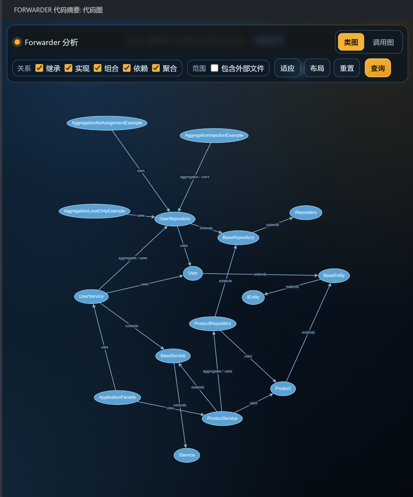
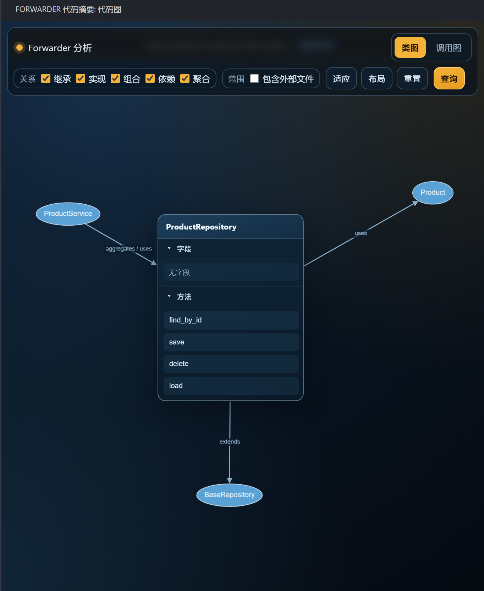
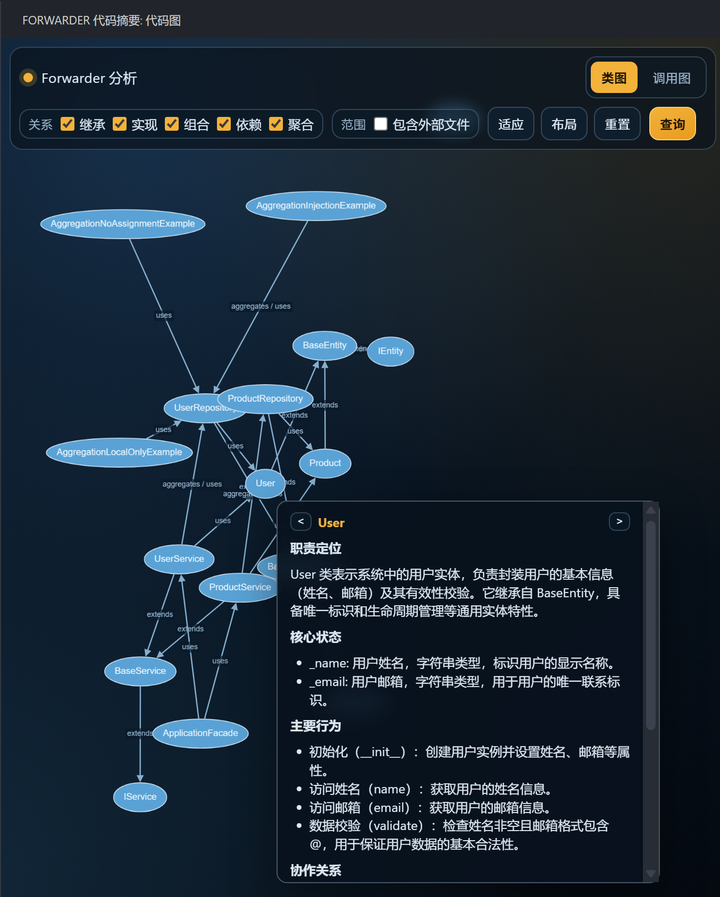

# Forwarder

English | [中文](README-zh.md)

Forwarder is a VS Code extension for code understanding. It uses VS Code language services to analyze relationships among classes, interfaces, functions, and methods, then renders interactive class graphs, call graphs, and call paths in the side bar. It can also generate AI summaries for key nodes via the VS Code Language Model API.

## What it's good for

- Quickly browsing structural relationships among classes, interfaces, and functions.
- Inspecting inheritance, implementation, composition, dependency, and aggregation around a specific type.
- Exploring outgoing / incoming / bidirectional call graphs around a function.
- Adding multiple functions in order and querying call paths between them.
- Generating concise AI summaries for functions, methods, classes, and interfaces.
- Jumping between graph nodes and source code to reduce manual call-chain tracing.

Forwarder is best suited for reading existing codebases and locating implementation paths. It is not a replacement for compilers, linters, or full-featured UML modeling tools.

## Core features

### Class graph

The Class Graph visualizes type structure in the workspace. Select relationship types as needed, then click `Query` to generate the graph.

Supported relationship types:

- `Extends`: inheritance.
- `Implements`: interface implementation.
- `Composes`: a class holds another class/interface via fields.
- `Dependencies`: a method depends on other types via parameters or return types.
- `Aggregates`: external parameters are assigned into same-typed fields (e.g. constructor injection / dependency injection).

When you click a class or interface node, Forwarder shows a center card with the type's fields and methods. Method entries can reveal source locations and can be added to the call path tray.

### Call graph

The Call Graph visualizes call relationships around a function or method. Put your cursor inside a function body and use the context menu or commands to set it as the call graph center. You can also switch centers by right-clicking nodes inside the graph.

Call Graph supports:

- Setting call depth.
- Viewing `Outgoing`, `Incoming`, or `Both` directions.
- Choosing whether to include symbols outside the workspace.
- Jumping from nodes back to source code.
- Adding nodes to the ordered call path.

### Ordered call path

Forwarder provides a shared call path tray. You can add functions to it from editor commands, the class card method list, or call graph nodes, and reorder them via drag and drop.

- With 2 functions selected, Forwarder queries the call path between them.
- With 3 or more functions selected, Forwarder stitches the path segment-by-segment in your specified order.
- If a segment cannot be connected, the result keeps failure segment details to help identify where the break happens.
- You can generate a path summary based on the result to understand what the call chain does.

### AI summaries

Forwarder uses the VS Code Language Model API to call available chat models and generate summaries for graph nodes.

Current capabilities:

- Function / method summary: based on signature, source range, and language.
- Class / interface summary: combines fields, method signatures, method summaries, and one-hop type relations.
- Call path summary: generated from summaries along the path and call order.
- Summary caching: keyed by target node, model, prompt version, language, and source hash, keeping a history.
- Model selection: open the model menu in the Forwarder title area to choose the active model.
- Stale marking: when source code or relation context changes, old summaries can still be shown but will be marked as stale.

If a node has no summary, hover will not automatically trigger a model request. Long-press a function/method/class/interface node to trigger summary generation. Hovering a node that already has a summary shows the summary popover.

## Prerequisites

### VS Code version

Forwarder requires VS Code `1.107.1` or later.

### Language services

Forwarder relies on VS Code language services including Document Symbols, Definition, Type Hierarchy, and Call Hierarchy. Install and enable the corresponding language extension for your target language, for example:

- Python: `ms-python.python`
- TypeScript / JavaScript: built-in TypeScript language features
- Go: `golang.Go`
- Java: `redhat.java`
- C / C++: `ms-vscode.cpptools`
- C#: `ms-dotnettools.csharp`
- Rust: `rust-lang.rust-analyzer`
- PHP: `bmewburn.vscode-intelephense-client`

If a language service is not installed or temporarily unavailable, Forwarder will attempt to degrade gracefully, but symbols, relations, or call graphs may be incomplete.

### AI summary requirements

AI summaries require at least one available Language Model Chat model in VS Code. Typically, you need to:

- Install and sign in to GitHub Copilot Chat, or another extension that exposes the Language Model API to VS Code.
- Ensure your environment allows extensions to call chat models.
- Select an available model from the Forwarder model menu, or set a default model name in Settings.

If no model is available, graphs can still be used, but summary generation will fail.

## Quick start

1. Open a project folder in VS Code.
2. Wait for Forwarder to finish the initial indexing pass (large projects may take longer).
3. Open the Forwarder view from the Activity Bar.
4. In `Class Graph`, select relationship types and click `Query` to view global type relations.
5. Put your cursor inside a function/method and run `Forwarder: Set Function as Call Graph Center`, then switch to `Call Graph`.
6. Use `Forwarder: Add Function to Call Path` (or node context menus) to add multiple functions to the tray, then click `Path`.
7. Long-press a node to generate a summary; hover nodes with existing summaries to view them.

Common commands:

| Command | What it does |
| --- | --- |
| `Forwarder: Analyze Current File` | Analyze the active file |
| `Forwarder: Add Function to Call Path` | Add the function at the cursor to the call path tray |
| `Forwarder: Set Function as Call Graph Center` | Set the function at the cursor as the call graph center |

Default keybindings:

| Keybinding | What it does |
| --- | --- |
| `Ctrl+Alt+A` | Analyze current file |
| `Ctrl+Alt+F` | Add current function to call path |
| `Ctrl+Shift+F` / macOS `Cmd+Shift+F` | Open the Forwarder side bar |

## Configuration

Search for `Forwarder` in VS Code Settings to adjust the options below.

### UI language

| Setting | Default | Description |
| --- | --- | --- |
| `forwarder.ui.language` | `auto` | Controls the display language of the Forwarder webview UI. `auto` follows the VS Code display language: `zh-CN` for Chinese UI; English otherwise. |

### Scan scope

| Setting | Default | Description |
| --- | --- | --- |
| `forwarder.analysis.includePattern` | `**/*.{ts,js,py,java,cpp,c,cs,go,rs,rb,php}` | Glob pattern of files to scan and include in the code graph. |
| `forwarder.analysis.excludePattern` | `**/{node_modules,.git,.svn,out,dist,build,bin,obj,vendor,target,.vscode,.idea}/**` | Glob pattern of folders/files excluded from structure scanning. |

After changing scan scope, Forwarder resets the index and rescans the workspace.

### LLM and summaries

| Setting | Default | Description |
| --- | --- | --- |
| `forwarder.llm.defaultModelName` | empty | Display name of the default model. When empty, the first available model is used. |
| `forwarder.llm.summaryConcurrency` | `2` | Maximum concurrency of the summary queue. |
| `forwarder.llm.classRelationBriefTopK` | `3` | Max number of related classes used for relation briefs while generating a class summary. Set to `0` to disable. |
| `forwarder.llm.functionBatchMaxFunctions` | `8` | Maximum number of functions included in one batch summary request. |
| `forwarder.llm.functionBatchMaxFunctionLines` | `120` | Maximum number of source lines included per function in a batch summary request. |
| `forwarder.llm.functionBatchMaxFunctionChars` | `6000` | Maximum number of source characters included per function in a batch summary request. |
| `forwarder.llm.functionBatchMaxTotalChars` | `24000` | Maximum total source characters included across all functions in one batch summary request. |
| `forwarder.llm.summaryHistoryLimit` | `3` | Number of successful summaries retained for the same target/model/prompt-version/language. |
| `forwarder.llm.longPressMs` | `650` | Long-press duration (ms) required to trigger a summary request on nodes. |
| `forwarder.llm.summaryHoverDelayMs` | `1000` | Hover delay (ms) before showing the summary popover for nodes with existing summaries. |

These settings only affect future summary generation and cache writes. Existing summary cache files are not proactively migrated or trimmed.

## Scope

Forwarder reads Document Symbols provided by VS Code, so it can theoretically work with many supported languages. How complete relation extraction and call graphs are depends on language service quality and the current adapter coverage of Forwarder.

In the first release, dedicated type-relation adapters primarily cover TypeScript/JavaScript, Python, and Go. Other languages may still show basic symbols and partial call capability when their language services are available, but relations like inheritance/dependency/aggregation may be incomplete.

## How it works

Forwarder maintains a workspace-level local snapshot of the code graph and performs incremental updates on file save/create/delete/rename. When you query a graph view, the webview reads the current snapshot and shows index status. If background queues are still updating, results may be marked as stale, and the UI may suggest re-query after the queue becomes idle.

Summary data is stored separately from graph snapshots. Summary bodies are loaded on demand. Cache keys include target node, model, prompt version, language, and source hash, so old summaries are not overwritten after source changes; they remain available but may be stale.

## Known issues

- Initial indexing can be slow on large projects; graph queries may be incomplete while the queue is still running.
- Results depend heavily on VS Code language services. Some languages/frameworks/dynamic call patterns may not be analyzed precisely.
- Type relation extraction is more complete for TypeScript/JavaScript, Python, and Go in the first release; other languages may only show basic symbols and partial call info.
- AI summaries require an available VS Code Language Model Chat model. Model permissions/quotas/network/Copilot sign-in issues can prevent summary generation.
- Call path summaries are still early; when paths are incomplete, summaries are missing, or summaries are stale, generated content may be conservative.
- Several debug commands are still included for diagnosing LSP/graph/query/summary flows; most users do not need them.
- Export features (media/images/UML formats) and project-wide Q&A are not available yet.

## Roadmap

- Add dedicated relation adapters for more languages.
- Improve index progress feedback, graph pruning, and interaction performance for large projects.
- Improve call path summaries and the path explanation UI.
- Add graph export capabilities such as PNG/SVG or more standard UML/PlantUML representations.
- Introduce project-wide Graph-RAG style Q&A capabilities.

## Feedback

If you encounter issues or have suggestions, please open an issue in the project repository and include the language, VS Code version, relevant language extensions, reproduction steps, and Forwarder logs when possible.
